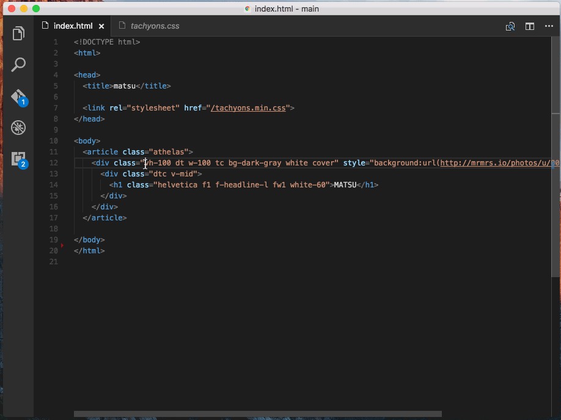

# Tachyons in VSCode

### Goto & Peek definition

### Usage

If a project contains `node_modules/tachyons`, thie extension will use `node_modules/tachyons/css/tachyons.css`
to provide definitions.

Otherwise, use the one packaged with the extension. Currently 4.5.3.

## Changelog

- 0.2.0 | 2016-11-27  
Upgrade to TS 2.0 and resolve upstream change to `getWordRangeAtPosition`

## License
MIT